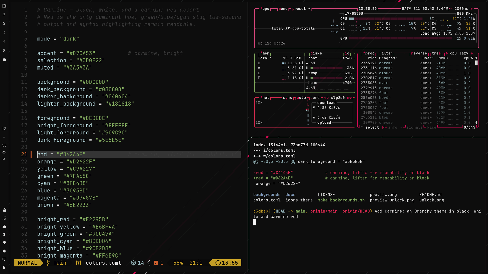
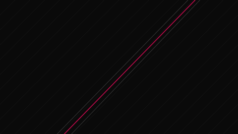
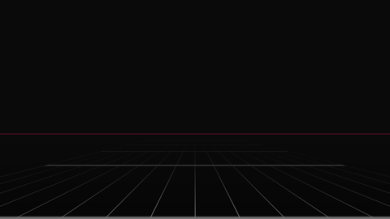
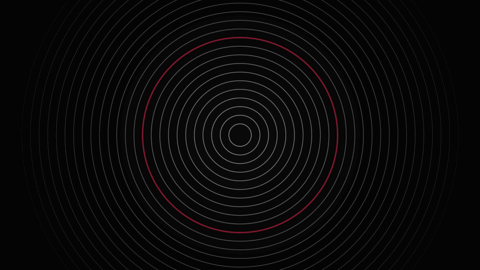
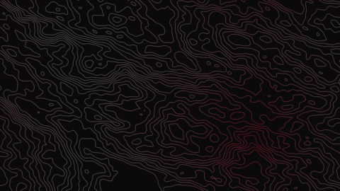
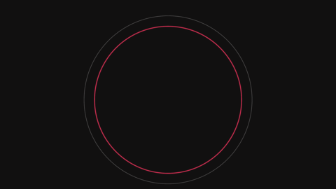
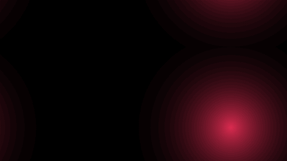

# Carmine

An Omarchy theme: black, white, and carmine red.



## Install

```bash
omarchy theme install https://github.com/ecylmz/omarchy-carmine-theme
omarchy theme set carmine
```

## Palette

| | |
|---|---|
| background | `#0D0D0D` |
| foreground | `#DEDEDE` |
| red | `#D62A4E` |
| accent | `#D70A53` |

Red is the only dominant hue. Green, blue and cyan are kept low-saturation so
diffs, `ls` output and syntax highlighting stay readable without competing
with it.

Every color comes from `colors.toml`; Omarchy generates the configs for
Alacritty, foot, kitty, Ghostty, btop, Neovim, Helix, Chromium, Hyprland
borders and the bar from it. `icons.theme` sets the icon theme to `Yaru-red`,
and `unlock.png` recolors the Plymouth boot and unlock splash.

## Backgrounds

| | | | |
|:--:|:--:|:--:|:--:|
|  |  |  |  |
| slash *(default)* | horizon | rings | contour |
|  |  |  | |
| eclipse | halftone | void | |

Seven procedural wallpapers in `backgrounds/`. Cycle them with
`omarchy theme bg next`, regenerate with:

```bash
./make-backgrounds.sh            # 2560x1440
./make-backgrounds.sh 3840 2160  # 4K
```

Requires ImageMagick. Keep the `RED` / `BRED` / `BG` values in the script in
sync with `colors.toml`.
